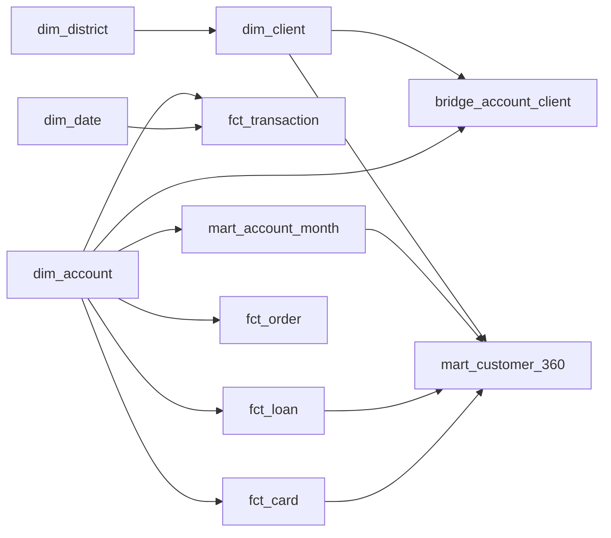

# Project Specification

## Final project title

**Retail Bank Customer 360: Growth, Engagement & Credit Risk Analytics**

中文：**零售银行客户 360：增长、活跃与信贷风险分析**

## One-sentence pitch

Build a governed analytical layer from eight legacy banking tables, then use tested SQL and an interactive dashboard to explain customer value, account engagement, product adoption, and lending risk.

## Why this complements AI Business Copilot

The first portfolio project demonstrates AI-product thinking. This project demonstrates the analytical foundation employers often test directly: relational modelling, SQL depth, metric governance, reproducibility, dashboard design, and disciplined business interpretation. A retail-bank dataset also maps more directly to digital-banking, financial-technology, BI, and data-product roles than another e-commerce order analysis.

## Decision users

- Retail banking growth manager: portfolio mix, engagement, and product penetration
- Customer analytics lead: customer/account segments and cohort behaviour
- Credit-risk analyst: portfolio risk concentration and leakage-safe modelling choices
- BI/data-product manager: metric definitions, filters, drill-downs, and reproducibility

## Scope

### In scope

- Eight-table ingestion, cleaning, and data-quality reporting
- DuckDB warehouse with raw, staging, dimensional, and mart layers
- Customer/account 360 and monthly activity grain
- Value and behaviour segmentation using explainable business rules
- Account-opening cohorts and active-month retention proxy
- Card/loan penetration and product-engagement views
- Descriptive loan-risk analysis; optional interpretable baseline model after a leakage review
- Streamlit dashboard with executive summary and drill-down

### Out of scope

- True churn prediction: no closure/churn label exists
- Profit or customer lifetime value in currency: margin, fee, and servicing-cost data are absent
- Causal cross-sell uplift: there is no randomized treatment
- Real-time scoring or production banking decisions
- Claims about modern Czech or global banking behaviour

## Core data model

The bridge is necessary because an account can have an owner and an authorized user. Customer-level money metrics will default to the account owner to avoid double counting; authorized-user analyses will be clearly labelled.

## Analytical modules

1. **Executive portfolio:** customers, accounts, monthly active accounts, inflow/outflow, balances, product penetration, and loan health.
2. **Customer 360 and segments:** demographics, tenure, activity, balance stability, inflows, transaction mix, and products.
3. **Cohort and engagement:** opening cohort, active-month retention proxy, transaction frequency, and channel/type mix.
4. **Growth opportunities:** descriptive card/loan penetration gaps by behaviour segment; no causal sales claim.
5. **Risk:** mature-loan problem rate, amount-weighted exposure, delinquency status, and district/account context.

## Technical stack

- **Environment:** Conda on macOS
- **Warehouse:** DuckDB, stored locally and rebuilt from source
- **Transformation:** SQL first; Python/Pandas for ingestion, quality reports, and analysis where SQL is less suitable
- **Dashboard:** Streamlit + Plotly
- **Quality:** pytest, SQL assertions, structured logs, and pipeline row-count summaries
- **Packaging:** Makefile entry points, documented configuration, screenshots, and a local/deployment demo path

## Definition of done

- A new machine can rebuild the analytical database by following the README.
- Core joins, grain, row counts, accepted values, and business metrics have automated checks.
- At least two valid analytical lenses are delivered: activity cohort plus customer/product/risk analysis.
- Dashboard filters and drill-downs answer explicit business questions.
- Each key chart includes a finding, limitation, and proposed next action.
- Raw data, databases, credentials, and `.env` are absent from Git history.
- Resume bullets and interview notes describe only completed work and observed results.
