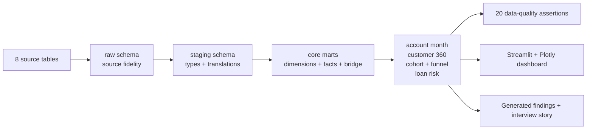

# Retail Bank Customer 360

**Growth, Engagement & Credit Risk Analytics with SQL, DuckDB, Python and Streamlit**

An end-to-end analytics portfolio project that turns eight relational tables from a real anonymized Czech bank into a governed customer 360, activity-cohort analysis, onboarding funnel, lending-risk view, and interactive decision dashboard.

The project is intentionally centred on analytical SQL, data modelling, metric definitions, reproducibility, and honest interpretation—not an AI wrapper.

## 30-second portfolio pitch

A retail bank has customers, accounts, permissions, transactions, cards, standing orders, loans, and district demographics in separate legacy tables. I built a reproducible DuckDB warehouse that preserves raw values, translates and types the source, prevents account/client double counting, and exposes tested business marts. A Streamlit dashboard then helps growth, customer, and risk teams explore portfolio composition, customer segments, account-opening cohorts, early product adoption, and pre-origination lending indicators.

## What this demonstrates

- **SQL:** eight-table joins, CTEs, window functions, conditional aggregation, cohort grids, funnels, as-of feature windows, and reconciliation queries
- **Data modelling:** raw/staging/mart layers, dimensions, facts, a client-account bridge, governed grains, and owner-only money attribution
- **Python:** deterministic acquisition, SHA-256 validation, source profiling, DuckDB orchestration, generated reporting, testing, and Streamlit
- **Business analytics:** customer value/activity segments, product penetration, cohort suitability, onboarding, portfolio risk, and actionable limitations
- **Engineering:** Conda environment, Makefile entry points, 20 data assertions, pytest integration tests, linting, CI, and milestone Git history

## Verified portfolio results

| Question | Evidence-backed result | Interpretation boundary |
|---|---|---|
| How large is the portfolio? | 4,500 owner accounts and 1,056,320 transactions | Historical 1990s Czech bank data |
| How common are bank products? | Card penetration 19.8%; loan penetration 15.2%; 68.8% hold neither | A product gap is not automatic sales eligibility |
| Does the data support churn analysis? | 12-month activity-retention proxy is 99.8% | Near-saturation plus no closure label means no defensible churn model |
| What is the finished-loan problem rate? | 31 of 234 finished loans, or 13.25% | Running loans are excluded from final outcomes |
| Which pre-loan signals differ? | Payment burden averaged 33.5% for defaulted vs 17.9% for repaid loans | Association only; 31 defaults and historical policy context |
| Is negative balance relevant? | 25.8% of defaulted borrowers went negative before origination vs 0% of repaid borrowers | Requires back-testing on newer representative data |

Full findings and recommendations are in [Analysis Findings](docs/ANALYSIS_FINDINGS.md).

## Dashboard decision flow

1. **Executive overview:** portfolio KPIs, active accounts, inflow/outflow, balances, product penetration, and finished-loan problem rate
2. **Customer 360:** region/product/segment filters, transparent behaviour segments, balance/activity comparison, and account-level balance drill-down
3. **Cohort & funnel:** opening-cohort balance trajectories, a conjunctive 12-month adoption funnel, and the deliberately labelled activity-retention proxy
4. **Lending risk:** outcome mix, payment burden, regional rates with sample size, and pre-origination features only
5. **Definitions:** metric rules and interpretation guardrails beside the charts

## Architecture



See [Data Model](docs/DATA_MODEL.md) for grains, keys, and the double-counting policy.

## Rebuild from a new machine

Prerequisites: macOS/Linux, Conda, Git, and network access for the public source mirror.

```bash
git clone <your-repository-url>
cd retail-bank-analytics
conda env create -f environment.yml
conda activate retail-bank-analytics

make download-data
make audit-source
make warehouse
make analysis
make verify
make dashboard
```

Open <http://localhost:8501> after the last command.

The download command is an explicit acknowledgement that the source was publicly distributed for a research challenge but has no modern redistribution licence identified. Raw data remains local and Git-ignored.

## Useful commands

| Command | Purpose |
|---|---|
| `make check` | Dependency-free repository health check |
| `make download-data` | Download eight pinned files and verify SHA-256 |
| `make audit-source` | Validate row counts, headers, keys, missingness, and checksums |
| `make warehouse` | Rebuild DuckDB and run all zero-row assertions |
| `make analysis` | Regenerate findings from tested marts |
| `make verify` | Run Ruff, pytest, and the project health check |
| `make dashboard` | Start the local decision dashboard |

## Trust and quality controls

- Eight source checksums pinned to one mirror commit
- Exact row-count and column contracts
- Unique primary-key and foreign-key assertions
- Accepted-value, date-range, signed-amount, and zero-amount rules
- One account owner required per account
- Unique account-month and customer-360 grains
- Monotonic funnel and bounded cohort-rate checks
- Loan feature window required to end before origination
- Cash-flow reconciliation and finished-loan denominator tests
- Automated Streamlit render test

Current local verification: **20 data-quality assertions and 11 pytest tests pass**.

## Repository map

```text
app/                 Streamlit decision dashboard
config/              Non-secret source and warehouse configuration
data/                 Git-ignored raw, interim, and processed data
docs/                 Findings, data model, metrics, decisions, and interview materials
outputs/              Git-ignored local analytical outputs
scripts/              Download, audit, warehouse, analysis, and validation entry points
sql/staging/          Typed and translated source layer
sql/marts/            Dimensions, facts, customer 360, cohort, funnel, and risk marts
sql/analysis/         Business-facing dashboard views
src/                  Reusable Python package
tests/                Foundation, warehouse, metric, leakage, and dashboard tests
```

## Data source and responsible use

The project uses the Financial Data Set from the PKDD'99 Discovery Challenge, prepared by Petr Berka and Marta Sochorova from anonymized Czech bank data.

- Current academic entry: <https://relational.fel.cvut.cz/dataset/Financial>
- Pinned acquisition mirror: <https://github.com/jlacko/berka-dataset>, commit `77e9972...`
- Raw archive and all databases are excluded from Git
- Every downloaded source file is checked before use

Read [Data Use Notice](docs/DATA_USE_NOTICE.md) and [Dataset Evaluation](docs/DATASET_EVALUATION.md) for the licensing caveat and alternatives.

## Deliberate limitations

- “Retention” is continued customer-operation activity, not confirmed customer retention.
- Net cash flow is not bank profit or customer income.
- Product-penetration differences do not establish treatment uplift.
- Full-lifetime segments are not allowed in origination-time risk features.
- Regional and segment rates can be unstable when loan counts are small.
- No model was promoted in v1: only 31 finished-loan defaults are available, and the strongest portfolio value is governed analytics rather than an unstable accuracy headline.

## Portfolio materials

- [Project specification](PROJECT_SPEC.md)
- [Nine-day roadmap](ROADMAP.md)
- [Decision log](DECISIONS.md)
- [Metric dictionary](docs/METRIC_DICTIONARY.md)
- [Source audit](docs/SOURCE_AUDIT.md)
- [Data-quality report](docs/DATA_QUALITY_REPORT.md)
- [Analysis findings](docs/ANALYSIS_FINDINGS.md)
- [Dashboard QA record](docs/DASHBOARD_QA.md)
- [Dashboard demo script](docs/DEMO_SCRIPT.md)
- [Interview guide](docs/INTERVIEW_GUIDE.md)
- [Deployment plan](docs/DEPLOYMENT.md)
