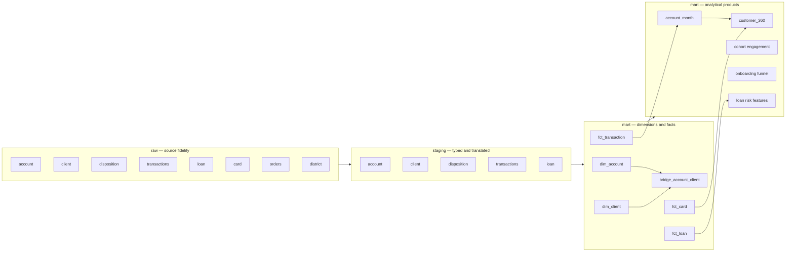

# Analytical Data Model

The warehouse separates source fidelity from business usability. Raw values remain unchanged, staging performs explicit casting and translation, and marts expose stable grains for analysis and the dashboard.

## Grains and keys

| Object | Grain | Key / guardrail |
|---|---|---|
| `raw.*` | One row per source record | All columns retained as strings |
| `staging.transactions` | One transaction | `transaction_id`; positive amount plus derived signed amount |
| `bridge_account_client` | One account-client permission | Owner and authorized user remain distinct |
| `account_month` | One account-observed month | Deterministic ending balance uses date and transaction ID ordering |
| `account_360` | One account | Product and lifetime metrics; no client attribution yet |
| `customer_360` | One account owner | Owner-only money attribution prevents joint-access double counting |
| `cohort_activity_retention` | One opening cohort-relative month | Customer-operation activity proxy, not confirmed retention |
| `onboarding_funnel` | One conjunctive stage | Every later stage is a strict subset of the prior stage |
| `loan_risk_features` | One loan | Transaction features end strictly before loan origination |

## Code translation policy

Original Czech codes remain in `*_code` fields. English labels are additional fields, never destructive replacements. This makes the analysis readable while retaining a traceable path to the source.

## Why the bridge matters

The dataset contains 4,500 account owners and 869 authorized users. Joining transactions directly through every disposition would duplicate account balances and cash flow. Portfolio money metrics therefore stay at account grain; customer 360 assigns them only to the `owner` relationship. Authorized-user behaviour can be analysed separately without corrupting totals.
